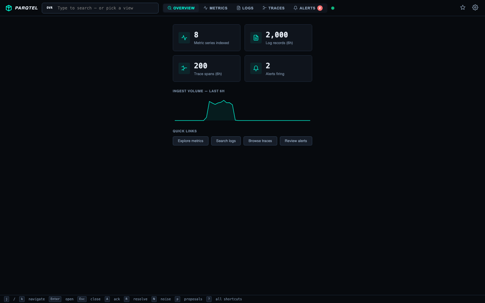
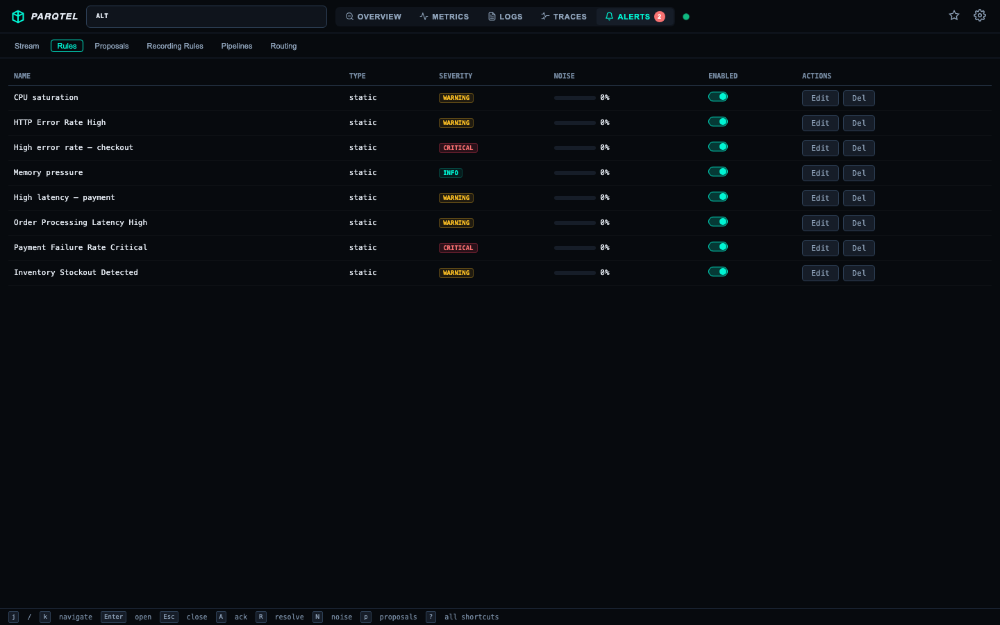

<p align="center">
  <h1 align="center">Parqtel</h1>
  <p align="center">Ultra-lightweight SRE observability engine — streaming OpenTelemetry metrics, logs, and traces into compressed Parquet</p>
</p>

<p align="center">
  <a href="https://github.com/parqtel/parqtel-oss/actions/workflows/ci.yml"></a>
  <a href="https://github.com/parqtel/parqtel-oss/actions/workflows/release.yml"></a>
  <a href="https://github.com/parqtel/parqtel-oss/blob/main/LICENSE"></a>
  <a href="https://ghcr.io/parqtel/parqtel-oss"></a>
  <a href="https://github.com/parqtel/parqtel-oss/pkgs/container/charts%2Fparqtel"></a>
  
  
  <a href="https://securityscorecards.dev/viewer/?uri=github.com/parqtel/parqtel-oss"></a>
  <a href="https://github.com/parqtel/parqtel-oss/security"></a>
  <a href="https://github.com/parqtel/parqtel-oss/actions/workflows/release.yml"></a>
  <a href="https://github.com/parqtel/parqtel-oss/releases"></a>
  <a href="https://parqtel.github.io"></a>
  
</p>

<p align="center">
  <a href="docs/GETTING_STARTED.md"><b>Getting Started</b></a> •
  <a href="docs/TUTORIALS.md">Tutorials</a> •
  <a href="CONTRIBUTING.md">Contributing</a> •
  <a href="#features">Features</a> •
  <a href="#architecture">Architecture</a> •
  <a href="#api-reference">API</a> •
  <a href="docs/MCP.md">MCP</a> •
  <a href="docs/DEPLOYMENT.md">Deployment</a> •
  <a href="docs/TROUBLESHOOTING.md">Troubleshooting</a>
</p>

---

## What is Parqtel?

Parqtel is a single-binary observability backend written in Rust that ingests OpenTelemetry (OTLP) signals and stores them as compressed Apache Parquet files. It exposes a Prometheus-compatible query API, a Grafana SimpleJSON datasource, and a built-in alerting engine — all with minimal resource footprint.

**Key design goals:**
- **Minimal footprint** — single static binary, ~15 MB Docker image (distroless)
- **Columnar storage** — Parquet + Zstd compression for 10-20x storage reduction
- **Drop-in compatibility** — works with existing Prometheus/Grafana dashboards
- **AI-native** — Model Context Protocol (MCP) servers for LLM-driven incident response

## Common Use Cases

| Use Case | Solution |
|----------|----------|
| **Low-cost Archiving** | Stream OTel data to Parquet for long-term storage with 90% compression vs Prometheus TSDB. |
| **Edge Observability** | Deploy on resource-constrained edge devices (IoT, ARM) to local-first telemetry. |
| **Log-to-Metric Pipelines** | Extract business metrics from high-volume Nginx or app logs using YAML pipelines. |
| **AI Incident Response** | Use MCP servers to give LLMs direct access to your telemetry for automated RCAs. |
| **Serverless Monitoring** | Ingest ephemeral logs/metrics from Lambda/Cloud Run without managing a heavy cluster. |

## 🗺 Documentation Map

| Area | Guides |
|------|--------|
| **Onboarding** | [Getting Started](docs/GETTING_STARTED.md) • [Glossary](docs/GLOSSARY.md) • [FAQ](docs/FAQ.md) |
| **Learning** | [Tutorials](docs/TUTORIALS.md) • [Use Cases](#common-use-cases) |
| **Querying** | [**PQL Guide**](docs/PQL_GUIDE.md) — ParQL metrics, ParqtelQL log/trace search, cross-signal pipelines |
| **Deep Dive** | [Architecture](docs/ARCHITECTURE.md) • [Configuration](docs/CONFIGURATION.md) • [Developer Guide](docs/DEVELOPER_GUIDE.md) • [MCP Integrations](docs/MCP.md) • [Query Functions](docs/QUERY_FUNCTIONS.md) • [UI/UX Plan](docs/UI_UX_IMPROVEMENT_PLAN.md) • [CI/CD](docs/CI_CD.md) |
| **Operations** | [Deployment](docs/DEPLOYMENT.md) • [Troubleshooting](docs/TROUBLESHOOTING.md) • [Best Practices](docs/BEST_PRACTICES.md) • [Testing & Validation](docs/TESTING.md) |
| **Community** | [Contributing](CONTRIBUTING.md) • [Code of Conduct](CODE_OF_CONDUCT.md) • [Security](SECURITY.md) |

## Features

| Category | Capabilities |
|----------|-------------|
| **Ingestion** | OTLP gRPC (`:4317`, the OTel SDK default) + HTTP protobuf & JSON for metrics, logs, and traces |
| **Storage** | Block-based Parquet with Zstd/Snappy/LZ4, automatic compaction, configurable retention |
| **Query** | PromQL-compatible instant & range queries, label matching, aggregations (sum, avg, rate, histogram_quantile, etc.) |
| **Alerting** | YAML-defined rules, threshold & anomaly detection, state machine (Inactive→Pending→Firing→Resolved), background evaluation loop (15s), noise scoring |
| **Pipeline** | Recording rules, stream processing pipelines, metric extraction from logs |
| **Span-metrics (RED)** | Auto-derived `traces_service_{requests,errors,duration_ms}_total` per service/operation from server spans — zero-config RED dashboards in Grafana |
| **Tail sampling** | Trace-coherent sampling (errors/slow traces always kept, deterministic ratio per service) — controls trace storage volume while RED metrics stay unsampled |
| **Visualization** | Built-in web UI, Grafana SimpleJSON datasource, Prometheus-compatible `/api/v1/*` |
| **MCP** | 7 AI tool servers (Slack, PagerDuty, Jira, Notion, Discord, Google Docs, Parqtel) |
| **Operations** | Health checks, `/metrics` endpoint, graceful shutdown, CLI subcommands |

## Built-in Web UI

Parqtel ships with a zero-dependency embedded web console at `/ui` — no CDNs, no web fonts, no frameworks, works air-gapped. Single file, ~42 KB gzipped, served with gzip + ETag caching at zero per-request server cost.

| Overview | Metrics |
|----------|---------|
|  |  |

| Logs | Traces |
|------|--------|
|  |  |

| Alerts (live firing) | Alert rules |
|---------------------|-------------|
|  |  |

**Features:** Overview landing pane with per-signal stat cards, deep-linkable URLs (share the exact query + time range), guided metrics Builder⇄Code query toggle with live PromQL preview, log field facets, trace-grouped browse list + waterfall, alert stream with Evidence tab (incident-window metric chart + correlated logs), form-based rule editor with YAML escape hatch, saved views, keyboard shortcuts (`?` for the reference), WCAG AA contrast and reduced-motion support.

The design system and phased modernization plan live in [docs/UI_UX_IMPROVEMENT_PLAN.md](docs/UI_UX_IMPROVEMENT_PLAN.md).

## Performance

Benchmarked with sustained 1000 samples/sec (metrics + logs + traces) for 15 minutes:

| Metric | Result |
|--------|--------|
| **Sustained throughput** | 972 samples/sec (zero errors) |
| **Total ingested** | 875,100 samples in 15 min |
| **Ingest p50** | 4.4ms per batch |
| **Ingest p99** | 63ms per batch |
| **Query p50 (instant)** | 12.7ms |
| **Query p99 (range)** | 160ms |
| **Immediate queryability** | 1.7ms (in-memory buffer) |
| **Data durability** | ✅ Survives container restart |

Hot-path optimizations (non-blocking flushes, row-group pruning, label caching) are detailed in [docs/benchmarks/PERFORMANCE.md](docs/benchmarks/PERFORMANCE.md) — scan throughput +39%, narrow-range queries decode only matching row groups, and Parquet writes no longer stall async workers.

## Architecture

**The telemetry flow** — OTLP in, Parquet down, three query surfaces up:

```
                          ┌─────────────────────────────────┐
                          │      OpenTelemetry SDKs          │
                          │   metrics · logs · traces       │
                          └───────┬─────────────────┬───────┘
                     OTLP gRPC :4317   OTLP HTTP /v1/*
                          └───────┴────────┬────────┘
                                            ▼
        ┌───────────────────────────────────────────────────────────────┐
        │                      parqtel (single binary)                   │
        │                                                                │
        │  INGEST          QUERY                 ANALYZE                 │
        │  ───────         ─────                 ───────                 │
        │  OTLP decode     ParQL (PromQL)        Alert engine            │
        │  Span-metrics    ├ instant + range      ├ rules + eval         │
        │    RED bridge    ├ binary ops/on()      ├ webhook routes       │
        │  Tail sampling   ParqtelQL search       ├ silences             │
        │  Memory buffer   ├ logs + traces        └ MCP servers          │
        │  (all signals)   └ predicate pushdown     (Slack·PagerDuty·     │
        │                  PQL Pipelines            Jira·Notion·…)       │
        │                  fetch│filter│parse│                          │
        │                  stats│correlate          ── signals:          │
        │                                          metrics·logs·        │
        │  ── shared engine ──────────────────      traces·alerts        │
        │  BlockIndex · Scanner · label-value index · compaction         │
        └───────────────────────────┬───────────────────────────────────┘
                                    ▼
                    ┌───────────────────────────────┐
                    │   Compressed Parquet blocks    │
                    │   zstd · open format · query   │
                    │   with DuckDB/Spark/Athena     │
                    └───────────────────────────────┘

         SERVED:  Prometheus API · Grafana · /ui console · HTTP+gRPC
```

**Deep dive:** [Architecture](docs/ARCHITECTURE.md) • [PQL Guide](docs/PQL_GUIDE.md)

---

## Quick Start

```bash
# Clone and build
git clone https://github.com/parqtel/parqtel-oss.git
cd parqtel-oss
cargo build --release

# Start the server
./target/release/parqtel serve

# Or with configuration
./target/release/parqtel --config config/default.toml serve
```

### Run with Docker

```bash
docker build -t parqtel:local .
docker run -p 8080:8080 -v parqtel_data:/var/lib/parqtel parqtel:local
```

### Run with Docker Compose (full stack)

```bash
# First-time setup: copies .env.example → .env and starts everything
make dev-setup

# Or manually
cp .env.example .env
docker compose up -d
```

This starts Parqtel (port 9090), Grafana (port 3000), Prometheus (port 9091), and a load generator. MCP servers are defined in `docker-compose.yml` but commented out — uncomment the ones you need after adding the corresponding tokens to `.env`.

### Verify

```bash
# Health check (compose stack runs on port 9090; raw docker run uses 8080)
curl http://localhost:9090/health

# Send a metric via OTLP JSON
curl -X POST http://localhost:9090/v1/metrics/json \
  -H "Content-Type: application/json" \
  -d '{"resourceMetrics":[{"resource":{"attributes":[{"key":"service.name","value":{"stringValue":"demo"}}]},"scopeMetrics":[{"metrics":[{"name":"http_requests_total","gauge":{"dataPoints":[{"asDouble":42,"timeUnixNano":"1700000000000000000","attributes":[{"key":"method","value":{"stringValue":"GET"}}]}]}}]}]}]}'

# Query it back (Prometheus API)
curl "http://localhost:9090/api/v1/query?query=http_requests_total"
```

Instant queries look back 1 minute; older points become queryable via `/api/v1/query_range` after the block flush (default 2h blocks, checked every 5s). See [docs/GETTING_STARTED.md](docs/GETTING_STARTED.md) for the full walkthrough.

## API Reference

### Ingestion (OTLP)

OTel SDKs can export directly via **gRPC** at `:4317` (all three collector services, no collector sidecar needed), or via HTTP:

| Endpoint | Method | Description |
|----------|--------|-------------|
| `/v1/metrics` | POST | Ingest metrics (protobuf) |
| `/v1/metrics/json` | POST | Ingest metrics (JSON) |
| `/v1/logs` | POST | Ingest logs (protobuf) |
| `/v1/logs/json` | POST | Ingest logs (JSON) |
| `/v1/traces` | POST | Ingest traces (protobuf) |
| `/v1/traces/json` | POST | Ingest traces (JSON) |

### Query (Prometheus-compatible)

| Endpoint | Method | Description |
|----------|--------|-------------|
| `/api/v1/query` | GET | Instant query |
| `/api/v1/query_range` | GET | Range query |
| `/api/v1/labels` | GET | List all label names |
| `/api/v1/label/__name__/values` | GET | List metric names |
| `/api/v1/label/:name/values` | GET | List values for a label |

### Logs

| Endpoint | Method | Description |
|----------|--------|-------------|
| `/api/v1/logs` | GET | Query logs with filters |
| `/v1/logs/count` | GET | Count matching logs |
| `/v1/logs/fields` | GET | List available log fields |
| `/v1/logs/field_values` | GET | List values for a log field |

### Alerts

| Endpoint | Method | Description |
|----------|--------|-------------|
| `/api/v1/alerts` | GET | List all alerts |
| `/api/v1/alerts/:id` | GET | Get alert details |
| `/api/v1/alerts/:id/acknowledge` | POST | Acknowledge an alert |
| `/api/v1/alerts/:id/resolve` | POST | Resolve an alert |
| `/api/v1/rules` | GET/POST | List or create alert rules |
| `/api/v1/rules/:id` | PUT/DELETE | Update or delete a rule |

### Pipelines & Recording Rules

| Endpoint | Method | Description |
|----------|--------|-------------|
| `/api/v1/recording_rules` | GET/POST | List or create recording rule groups |
| `/api/v1/recording_rules/:name` | DELETE | Delete a recording rule group |
| `/api/v1/pipelines` | GET/POST | List or create pipeline definitions |
| `/api/v1/pipelines/:name` | DELETE | Delete a pipeline |

### Grafana SimpleJSON

| Endpoint | Method | Description |
|----------|--------|-------------|
| `/search` | POST | List available metrics |
| `/query` | POST | Execute time-series query |
| `/annotations` | POST | Query annotations |
| `/tag-keys` | POST | List tag keys |
| `/tag-values` | POST | List tag values |

### Operations

| Endpoint | Method | Description |
|----------|--------|-------------|
| `/health` | GET | Health check |
| `/metrics` | GET | Prometheus metrics (self-monitoring) |
| `/oas` | GET | OpenAPI 3.0 specification |
| `/ui` | GET | Built-in web UI |

## CLI Commands

```bash
parqtel serve              # Start the HTTP server (default)
parqtel compact            # Run one compaction pass and exit
parqtel inspect            # Print storage summary as JSON
parqtel export             # Export metric data to CSV
  --metric <name>
  --start <ISO8601>
  --end <ISO8601>
  --output <path>
```

### Environment Variables

| Variable | Description | Default |
|----------|-------------|---------|
| `PARQTEL_CONFIG` | Path to TOML config file | `config/default.toml` |
| `PARQTEL_BIND` | TCP bind address | `0.0.0.0:8080` |
| `PARQTEL__SERVER__GRPC_BIND_ADDRESS` | OTLP gRPC bind address (`""` disables) | `0.0.0.0:4317` |
| `PARQTEL__INGEST__TAIL_SAMPLING__SAMPLING_RATIO` | Fraction of traces kept after error/slow rules | `1.0` |
| `PARQTEL__INGEST__TAIL_SAMPLING__KEEP_ERRORS` | Keep traces containing ERROR spans | `true` |
| `PARQTEL_DATA_DIR` | Data directory | `data` |
| `RUST_LOG` | Log level | `info` |
| `PARQTEL__STORAGE__COMPRESSION` | Compression codec | `zstd` |
| `PARQTEL__STORAGE__RETENTION_DAYS` | Retention period | `7` |

## MCP Integrations

Parqtel ships with 7 Model Context Protocol (MCP) servers that enable LLM-driven incident response:

| Server | Port | Purpose |
|--------|------|---------|
| `parqtel-mcp-slack` | 3001 | Post alerts, RCA updates, and postmortems to Slack |
| `parqtel-mcp-pagerduty` | 3002 | Create/manage incidents, escalate, add notes |
| `parqtel-mcp-jira` | 3003 | Create issues, update tickets, link incidents |
| `parqtel-mcp-notion` | 3004 | Create/update postmortem pages, knowledge base |
| `parqtel-mcp-discord` | 3005 | Post alerts and updates to Discord channels |
| `parqtel-mcp-gdocs` | 3006 | Create/update Google Docs for postmortems |
| `parqtel-mcp-parqtel` | 3007 | Query Parqtel metrics/logs via MCP tools |

See [docs/MCP.md](docs/MCP.md) for detailed configuration and tool schemas.

## Deployment

| Method | Guide |
|--------|-------|
| Docker | Single container with volume mount |
| Docker Compose | Full stack (Parqtel + Grafana + Prometheus + MCP) — `docker compose up -d` from root |
| Kubernetes (Helm) | Production-grade with HPA, PDB, NetworkPolicy — chart at `charts/parqtel/` |
| systemd | Bare-metal Linux service — unit at `deploy/systemd/parqtel.service` |

See [docs/DEPLOYMENT.md](docs/DEPLOYMENT.md) for detailed instructions.

## Storage Design

Parqtel uses a **block-based storage model**:

- **Metrics blocks**: 2-hour duration, up to 1M rows, Zstd compressed
- **Log blocks**: 30-minute duration, up to 200K rows, Zstd compressed
- **Compaction**: Merges small blocks automatically (hourly)
- **Retention**: Configurable per-signal (default: 7 days metrics, 3 days logs)
- **Index**: In-memory block index with persistence, supports time-range and metric-name filtering

Each block is a self-contained Parquet file with row groups optimized for columnar scans.

## Configuration

Parqtel uses layered configuration via [Figment](https://github.com/SergioBenitez/Figment):

1. Built-in defaults
2. TOML config file (`config/default.toml`)
3. Environment variables (`PARQTEL__` prefix, `__` as separator)
4. CLI flags (highest priority)

See [docs/CONFIGURATION.md](docs/CONFIGURATION.md) for the full reference.

## Development

```bash
make dev-setup      # First-time local setup (copies .env, starts compose stack)
make build          # Debug build
make release        # Optimized release build
make test           # Run all tests
make lint           # rustfmt + clippy
make docker         # Build Docker image
make run            # Start server locally (from source)
make local-up       # Start compose stack
make local-rebuild  # Rebuild images and restart (after source changes)
make load           # Send synthetic data
make perf-audit     # Full performance audit
```

### Project Conventions

- **No unsafe code** — `#[forbid(unsafe_code)]`
- **No panics** — `unwrap`, `expect`, and `panic` are denied by clippy
- **Error handling** — `thiserror` for library errors, `anyhow` at the binary level
- **Async runtime** — Tokio with full features
- **Release binary** — LTO, single codegen unit, symbols stripped, abort on panic

## License

Apache License 2.0 — see [LICENSE](LICENSE).

## Contributing

Contributions are welcome! Please read [CODE_OF_CONDUCT.md](CODE_OF_CONDUCT.md) before submitting.

1. Fork the repository
2. Create a feature branch (`git checkout -b feature/my-feature`)
3. Run tests (`make test && make lint`)
4. Submit a pull request
