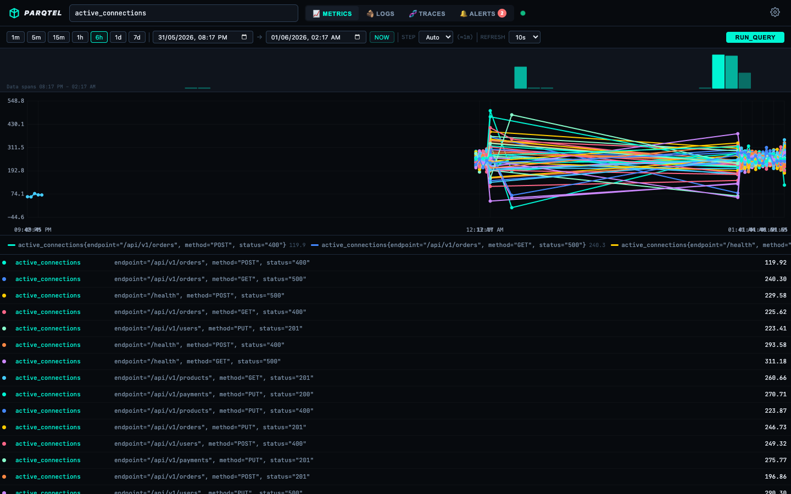
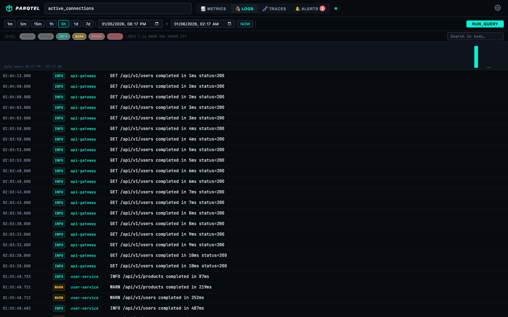
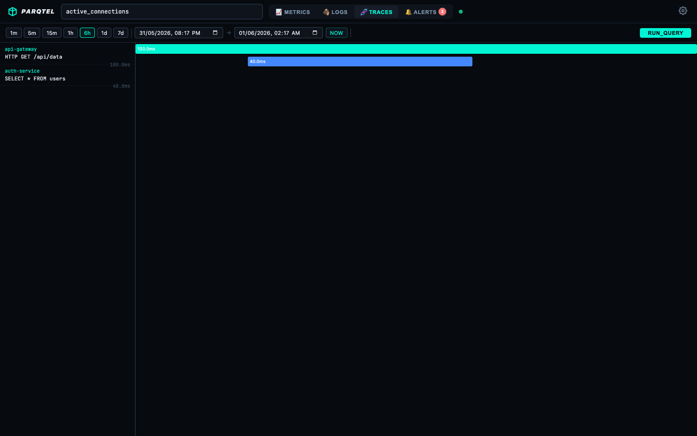
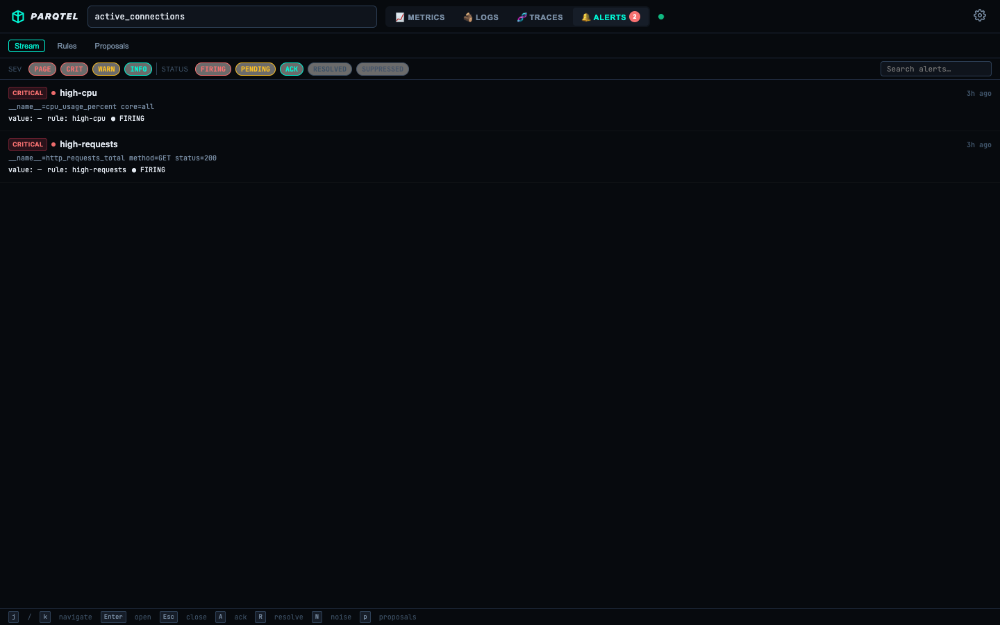

<p align="center">
  <h1 align="center">Parqtel</h1>
  <p align="center">Ultra-lightweight SRE observability engine — streaming OpenTelemetry metrics, logs, and traces into compressed Parquet</p>
</p>

<p align="center">
  <a href="docs/GETTING_STARTED.md"><b>Getting Started</b></a> •
  <a href="docs/TUTORIALS.md">Tutorials</a> •
  <a href="CONTRIBUTING.md">Contributing</a> •
  <a href="#features">Features</a> •
  <a href="#architecture">Architecture</a> •
  <a href="#api-reference">API</a> •
  <a href="docs/MCP.md">MCP</a> •
  <a href="docs/DEPLOYMENT.md">Deployment</a> •
  <a href="docs/TROUBLESHOOTING.md">Troubleshooting</a>
</p>

---

## What is Parqtel?

Parqtel is a single-binary observability backend written in Rust that ingests OpenTelemetry (OTLP) signals and stores them as compressed Apache Parquet files. It exposes a Prometheus-compatible query API, a Grafana SimpleJSON datasource, and a built-in alerting engine — all with minimal resource footprint.

**Key design goals:**
- **Minimal footprint** — single static binary, ~15 MB Docker image (distroless)
- **Columnar storage** — Parquet + Zstd compression for 10-20x storage reduction
- **Drop-in compatibility** — works with existing Prometheus/Grafana dashboards
- **AI-native** — Model Context Protocol (MCP) servers for LLM-driven incident response

## Common Use Cases

| Use Case | Solution |
|----------|----------|
| **Low-cost Archiving** | Stream OTel data to Parquet for long-term storage with 90% compression vs Prometheus TSDB. |
| **Edge Observability** | Deploy on resource-constrained edge devices (IoT, ARM) to local-first telemetry. |
| **Log-to-Metric Pipelines** | Extract business metrics from high-volume Nginx or app logs using YAML pipelines. |
| **AI Incident Response** | Use MCP servers to give LLMs direct access to your telemetry for automated RCAs. |
| **Serverless Monitoring** | Ingest ephemeral logs/metrics from Lambda/Cloud Run without managing a heavy cluster. |

## 🗺 Documentation Map

| Area | Guides |
|------|--------|
| **Onboarding** | [Getting Started](docs/GETTING_STARTED.md) • [Glossary](docs/GLOSSARY.md) • [FAQ](docs/FAQ.md) |
| **Learning** | [Tutorials](docs/TUTORIALS.md) • [Use Cases](#common-use-cases) |
| **Deep Dive** | [Architecture](docs/ARCHITECTURE.md) • [Configuration](docs/CONFIGURATION.md) • [Developer Guide](docs/DEVELOPER_GUIDE.md) • [MCP Integrations](docs/MCP.md) |
| **Operations** | [Deployment](docs/DEPLOYMENT.md) • [Troubleshooting](docs/TROUBLESHOOTING.md) • [Best Practices](docs/BEST_PRACTICES.md) • [Testing & Validation](docs/TESTING.md) |
| **Community** | [Contributing](CONTRIBUTING.md) • [Code of Conduct](CODE_OF_CONDUCT.md) • [Security](SECURITY.md) |

## Features

| Category | Capabilities |
|----------|-------------|
| **Ingestion** | OTLP/Proto & JSON for metrics, logs, and traces |
| **Storage** | Block-based Parquet with Zstd/Snappy/LZ4, automatic compaction, configurable retention |
| **Query** | PromQL-compatible instant & range queries, label matching, aggregations (sum, avg, rate, histogram_quantile, etc.) |
| **Alerting** | YAML-defined rules, threshold & anomaly detection, state machine (Inactive→Pending→Firing→Resolved), background evaluation loop (15s), noise scoring |
| **Pipeline** | Recording rules, stream processing pipelines, metric extraction from logs |
| **Visualization** | Built-in web UI, Grafana SimpleJSON datasource, Prometheus-compatible `/api/v1/*` |
| **MCP** | 7 AI tool servers (Slack, PagerDuty, Jira, Notion, Discord, Google Docs, Parqtel) |
| **Operations** | Health checks, `/metrics` endpoint, graceful shutdown, CLI subcommands |

## Built-in Web UI

Parqtel ships with a zero-dependency embedded web console at `/ui` — no separate frontend deployment needed.

| Metrics | Logs |
|---------|------|
|  |  |

| Traces | Alerts |
|--------|--------|
|  |  |

**Features:** PromQL autocomplete, time range selection, drag-to-zoom histogram, severity filtering, trace waterfall, alert state machine with acknowledge/resolve actions.

## Performance

Benchmarked with sustained 1000 samples/sec (metrics + logs + traces) for 15 minutes:

| Metric | Result |
|--------|--------|
| **Sustained throughput** | 972 samples/sec (zero errors) |
| **Total ingested** | 875,100 samples in 15 min |
| **Ingest p50** | 4.4ms per batch |
| **Ingest p99** | 63ms per batch |
| **Query p50 (instant)** | 12.7ms |
| **Query p99 (range)** | 160ms |
| **Immediate queryability** | 1.7ms (in-memory buffer) |
| **Data durability** | ✅ Survives container restart |

## Architecture

```
┌─────────────────────────────────────────────────────────────────────┐
│                         parqtel-server (Axum)                       │
│  ┌──────────┐  ┌──────────────┐  ┌────────────┐  ┌─────────────┐  │
│  │  OTLP    │  │ Prometheus   │  │  Grafana   │  │   Alert     │  │
│  │ Handlers │  │  API v1      │  │ SimpleJSON │  │   API       │  │
│  └────┬─────┘  └──────┬───────┘  └─────┬──────┘  └──────┬──────┘  │
│       │                │                │                │         │
├───────┼────────────────┼────────────────┼────────────────┼─────────┤
│       ▼                ▼                ▼                ▼         │
│  ┌─────────┐     ┌──────────┐     ┌──────────┐    ┌──────────┐   │
│  │ Ingest  │     │  Query   │     │ Pipeline │    │  Alert   │   │
│  │ Service │     │ Executor │     │  Engine  │    │  Engine  │   │
│  └────┬────┘     └────┬─────┘     └────┬─────┘    └────┬─────┘   │
│       │                │                │               │         │
├───────┼────────────────┼────────────────┼───────────────┼─────────┤
│       ▼                ▼                ▼               ▼         │
│  ┌────────────────────────────────────────────────────────────┐   │
│  │                    parqtel-core                             │   │
│  │  ┌─────────┐  ┌───────────┐  ┌──────────┐  ┌──────────┐  │   │
│  │  │ Storage │  │   Block   │  │ Compactor│  │Retention │  │   │
│  │  │ Engine  │  │   Index   │  │          │  │  Policy  │  │   │
│  │  └────┬────┘  └─────┬─────┘  └────┬─────┘  └────┬─────┘  │   │
│  │       └──────────────┴─────────────┴──────────────┘        │   │
│  └────────────────────────────┬───────────────────────────────┘   │
│                               ▼                                   │
│                    ┌─────────────────────┐                        │
│                    │  Parquet + Zstd     │                        │
│                    │  (filesystem)       │                        │
│                    └─────────────────────┘                        │
└───────────────────────────────────────────────────────────────────┘

┌─────────────────────────────────────────────────────────────────────┐
│                     MCP Servers (separate binaries)                  │
│  ┌───────┐ ┌──────────┐ ┌──────┐ ┌────────┐ ┌─────────┐ ┌──────┐ │
│  │ Slack │ │PagerDuty │ │ Jira │ │ Notion │ │ Discord │ │GDocs │ │
│  └───────┘ └──────────┘ └──────┘ └────────┘ └─────────┘ └──────┘ │
└─────────────────────────────────────────────────────────────────────┘
```

### Workspace Crates

| Crate | Description |
|-------|-------------|
| `parqtel-core` | Data models (metrics, logs, traces), storage engine, block index, compaction, retention, configuration |
| `parqtel-ingest` | OTLP protobuf/JSON decoding, block rotation, crash-safe Parquet writing |
| `parqtel-query` | PromQL-compatible query execution, label matching, aggregation functions |
| `parqtel-alert` | Alert rule registry, threshold evaluation, state machine, alert store |
| `parqtel-pipeline` | Recording rules, stream processing pipelines, PromQL/DQL expression evaluation |
| `parqtel-server` | Axum HTTP server, route handlers, middleware, telemetry, built-in UI |
| `parqtel-mcp-core` | Shared MCP server framework (JSON-RPC, rate limiting, tool registry) |
| `parqtel-mcp-*` | Individual MCP tool servers for external integrations |

## Quick Start

### Prerequisites

- Rust 1.85+ (for building from source)
- Docker (for containerized deployment)

### Run from Source

```bash
# Clone and build
git clone https://github.com/parqtel/parqtel-oss.git
cd parqtel-oss
cargo build --release

# Start the server
./target/release/parqtel serve

# Or with configuration
./target/release/parqtel --config config/default.toml serve
```

### Run with Docker

```bash
docker build -t parqtel:local .
docker run -p 8080:8080 -v parqtel_data:/var/lib/parqtel parqtel:local
```

### Run with Docker Compose (full stack)

```bash
cd deploy/compose
cp .env.example .env
docker-compose up -d
```

This starts Parqtel, Grafana (port 3000), Prometheus (port 9091), a load generator, and all MCP servers.

### Verify

```bash
# Health check
curl http://localhost:8080/health

# Send a metric via OTLP JSON
curl -X POST http://localhost:8080/v1/metrics/json \
  -H "Content-Type: application/json" \
  -d '{"resourceMetrics":[{"resource":{"attributes":[{"key":"service.name","value":{"stringValue":"demo"}}]},"scopeMetrics":[{"metrics":[{"name":"http_requests_total","gauge":{"dataPoints":[{"asDouble":42,"timeUnixNano":"1700000000000000000","attributes":[{"key":"method","value":{"stringValue":"GET"}}]}]}}]}]}]}'

# Query it back (Prometheus API)
curl "http://localhost:8080/api/v1/query?query=http_requests_total"
```

## API Reference

### Ingestion (OTLP)

| Endpoint | Method | Description |
|----------|--------|-------------|
| `/v1/metrics` | POST | Ingest metrics (protobuf) |
| `/v1/metrics/json` | POST | Ingest metrics (JSON) |
| `/v1/logs` | POST | Ingest logs (protobuf) |
| `/v1/logs/json` | POST | Ingest logs (JSON) |
| `/v1/traces` | POST | Ingest traces (protobuf) |
| `/v1/traces/json` | POST | Ingest traces (JSON) |

### Query (Prometheus-compatible)

| Endpoint | Method | Description |
|----------|--------|-------------|
| `/api/v1/query` | GET | Instant query |
| `/api/v1/query_range` | GET | Range query |
| `/api/v1/labels` | GET | List all label names |
| `/api/v1/label/__name__/values` | GET | List metric names |
| `/api/v1/label/:name/values` | GET | List values for a label |

### Logs

| Endpoint | Method | Description |
|----------|--------|-------------|
| `/api/v1/logs` | GET | Query logs with filters |
| `/v1/logs/count` | GET | Count matching logs |
| `/v1/logs/fields` | GET | List available log fields |
| `/v1/logs/field_values` | GET | List values for a log field |

### Alerts

| Endpoint | Method | Description |
|----------|--------|-------------|
| `/api/v1/alerts` | GET | List all alerts |
| `/api/v1/alerts/:id` | GET | Get alert details |
| `/api/v1/alerts/:id/acknowledge` | POST | Acknowledge an alert |
| `/api/v1/alerts/:id/resolve` | POST | Resolve an alert |
| `/api/v1/rules` | GET/POST | List or create alert rules |
| `/api/v1/rules/:id` | PUT/DELETE | Update or delete a rule |

### Pipelines & Recording Rules

| Endpoint | Method | Description |
|----------|--------|-------------|
| `/api/v1/recording_rules` | GET/POST | List or create recording rule groups |
| `/api/v1/recording_rules/:name` | DELETE | Delete a recording rule group |
| `/api/v1/pipelines` | GET/POST | List or create pipeline definitions |
| `/api/v1/pipelines/:name` | DELETE | Delete a pipeline |

### Grafana SimpleJSON

| Endpoint | Method | Description |
|----------|--------|-------------|
| `/search` | POST | List available metrics |
| `/query` | POST | Execute time-series query |
| `/annotations` | POST | Query annotations |
| `/tag-keys` | POST | List tag keys |
| `/tag-values` | POST | List tag values |

### Operations

| Endpoint | Method | Description |
|----------|--------|-------------|
| `/health` | GET | Health check |
| `/metrics` | GET | Prometheus metrics (self-monitoring) |
| `/oas` | GET | OpenAPI 3.0 specification |
| `/ui` | GET | Built-in web UI |

## CLI Commands

```bash
parqtel serve              # Start the HTTP server (default)
parqtel compact            # Run one compaction pass and exit
parqtel inspect            # Print storage summary as JSON
parqtel export             # Export metric data to CSV
  --metric <name>
  --start <ISO8601>
  --end <ISO8601>
  --output <path>
```

### Environment Variables

| Variable | Description | Default |
|----------|-------------|---------|
| `PARQTEL_CONFIG` | Path to TOML config file | `config/default.toml` |
| `PARQTEL_BIND` | TCP bind address | `0.0.0.0:8080` |
| `PARQTEL_DATA_DIR` | Data directory | `data` |
| `RUST_LOG` | Log level | `info` |
| `PARQTEL__STORAGE__COMPRESSION` | Compression codec | `zstd` |
| `PARQTEL__STORAGE__RETENTION_DAYS` | Retention period | `7` |

## MCP Integrations

Parqtel ships with 7 Model Context Protocol (MCP) servers that enable LLM-driven incident response:

| Server | Port | Purpose |
|--------|------|---------|
| `parqtel-mcp-slack` | 3001 | Post alerts, RCA updates, and postmortems to Slack |
| `parqtel-mcp-pagerduty` | 3002 | Create/manage incidents, escalate, add notes |
| `parqtel-mcp-jira` | 3003 | Create issues, update tickets, link incidents |
| `parqtel-mcp-notion` | 3004 | Create/update postmortem pages, knowledge base |
| `parqtel-mcp-discord` | 3005 | Post alerts and updates to Discord channels |
| `parqtel-mcp-gdocs` | 3006 | Create/update Google Docs for postmortems |
| `parqtel-mcp-parqtel` | 3007 | Query Parqtel metrics/logs via MCP tools |

See [docs/MCP.md](docs/MCP.md) for detailed configuration and tool schemas.

## Deployment

| Method | Guide |
|--------|-------|
| Docker | Single container with volume mount |
| Docker Compose | Full stack (Parqtel + Grafana + Prometheus + MCP) |
| Kubernetes (Helm) | Production-grade with HPA, PDB, NetworkPolicy |
| systemd | Bare-metal Linux service |

See [docs/DEPLOYMENT.md](docs/DEPLOYMENT.md) for detailed instructions.

## Storage Design

Parqtel uses a **block-based storage model**:

- **Metrics blocks**: 2-hour duration, up to 1M rows, Zstd compressed
- **Log blocks**: 30-minute duration, up to 200K rows, Zstd compressed
- **Compaction**: Merges small blocks automatically (hourly)
- **Retention**: Configurable per-signal (default: 7 days metrics, 3 days logs)
- **Index**: In-memory block index with persistence, supports time-range and metric-name filtering

Each block is a self-contained Parquet file with row groups optimized for columnar scans.

## Configuration

Parqtel uses layered configuration via [Figment](https://github.com/SergioBenitez/Figment):

1. Built-in defaults
2. TOML config file (`config/default.toml`)
3. Environment variables (`PARQTEL__` prefix, `__` as separator)
4. CLI flags (highest priority)

See [docs/CONFIGURATION.md](docs/CONFIGURATION.md) for the full reference.

## Development

```bash
make build          # Debug build
make release        # Optimized release build
make test           # Run all tests
make lint           # rustfmt + clippy
make docker         # Build Docker image
make run            # Start server locally
make load           # Send synthetic data
make perf-audit     # Full performance audit
```

### Project Conventions

- **No unsafe code** — `#[forbid(unsafe_code)]`
- **No panics** — `unwrap`, `expect`, and `panic` are denied by clippy
- **Error handling** — `thiserror` for library errors, `anyhow` at the binary level
- **Async runtime** — Tokio with full features
- **Release binary** — LTO, single codegen unit, symbols stripped, abort on panic

## License

Apache License 2.0 — see [LICENSE](LICENSE).

## Contributing

Contributions are welcome! Please read [CODE_OF_CONDUCT.md](CODE_OF_CONDUCT.md) before submitting.

1. Fork the repository
2. Create a feature branch (`git checkout -b feature/my-feature`)
3. Run tests (`make test && make lint`)
4. Submit a pull request
